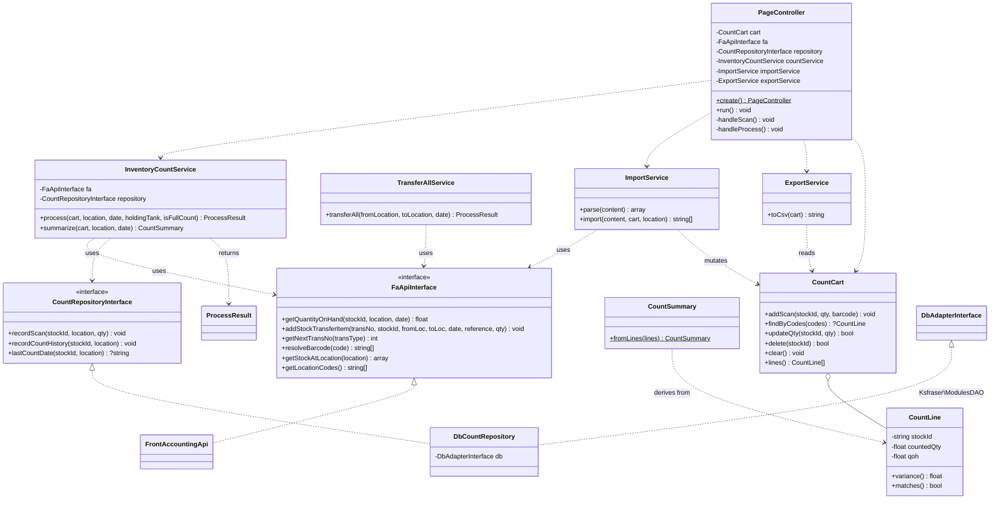
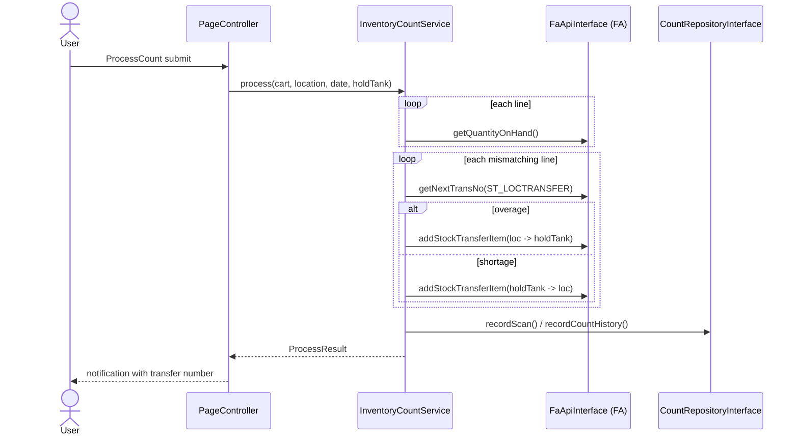

# UML — ksf_FA_InventoryCount

## Class Diagram (Mermaid)

```mermaid
classDiagram
    class PageController {
        -CountCart cart
        -FaApiInterface fa
        -CountRepositoryInterface repository
        -InventoryCountService countService
        -ImportService importService
        -ExportService exportService
        +create() PageController$
        +run() void
        -handleScan() void
        -handleProcess() void
    }

    class FaApiInterface {
        <<interface>>
        +getQuantityOnHand(stockId, location, date) float
        +addStockTransferItem(transNo, stockId, fromLoc, toLoc, date, reference, qty) void
        +getNextTransNo(transType) int
        +resolveBarcode(code) string[]
        +getStockAtLocation(location) array
        +getLocationCodes() string[]
    }
    class FrontAccountingApi

    class CountRepositoryInterface {
        <<interface>>
        +recordScan(stockId, location, qty) void
        +recordCountHistory(stockId, location) void
        +lastCountDate(stockId, location) ?string
    }
    class DbCountRepository {
        -DbAdapterInterface db
    }

    class InventoryCountService {
        -FaApiInterface fa
        -CountRepositoryInterface repository
        +process(cart, location, date, holdingTank, isFullCount) ProcessResult
        +summarize(cart, location, date) CountSummary
    }
    class TransferAllService {
        +transferAll(fromLocation, toLocation, date) ProcessResult
    }
    class ImportService {
        +parse(content) array
        +import(content, cart, location) string[]
    }
    class ExportService {
        +toCsv(cart) string
    }

    class CountCart {
        +addScan(stockId, qty, barcode) void
        +findByCodes(codes) ?CountLine
        +updateQty(stockId, qty) bool
        +delete(stockId) bool
        +clear() void
        +lines() CountLine[]
    }
    class CountLine {
        -string stockId
        -float countedQty
        -float qoh
        +variance() float
        +matches() bool
    }
    class CountSummary {
        +fromLines(lines) CountSummary$
    }
    class ProcessResult

    FaApiInterface <|.. FrontAccountingApi
    CountRepositoryInterface <|.. DbCountRepository
    DbAdapterInterface <|.. DbCountRepository : Ksfraser\\ModulesDAO
    InventoryCountService ..> FaApiInterface : uses
    InventoryCountService ..> CountRepositoryInterface : uses
    TransferAllService ..> FaApiInterface : uses
    ImportService ..> FaApiInterface : uses
    ImportService ..> CountCart : mutates
    ExportService ..> CountCart : reads
    PageController ..> InventoryCountService
    PageController ..> ImportService
    PageController ..> ExportService
    PageController ..> CountCart
    CountCart o-- CountLine
    CountSummary ..> CountLine : derives from
    InventoryCountService ..> ProcessResult : returns
```

## Sequence — Process Count

```mermaid
sequenceDiagram
    actor User
    participant PC as PageController
    participant CS as InventoryCountService
    participant FA as FaApiInterface (FA)
    participant Repo as CountRepositoryInterface

    User->>PC: ProcessCount submit
    PC->>CS: process(cart, location, date, holdTank)
    loop each line
        CS->>FA: getQuantityOnHand()
    end
    loop each mismatching line
        CS->>FA: getNextTransNo(ST_LOCTRANSFER)
        alt overage
            CS->>FA: addStockTransferItem(loc -> holdTank)
        else shortage
            CS->>FA: addStockTransferItem(holdTank -> loc)
        end
    end
    CS->>Repo: recordScan() / recordCountHistory()
    CS-->>PC: ProcessResult
    PC-->>User: notification with transfer number
```
